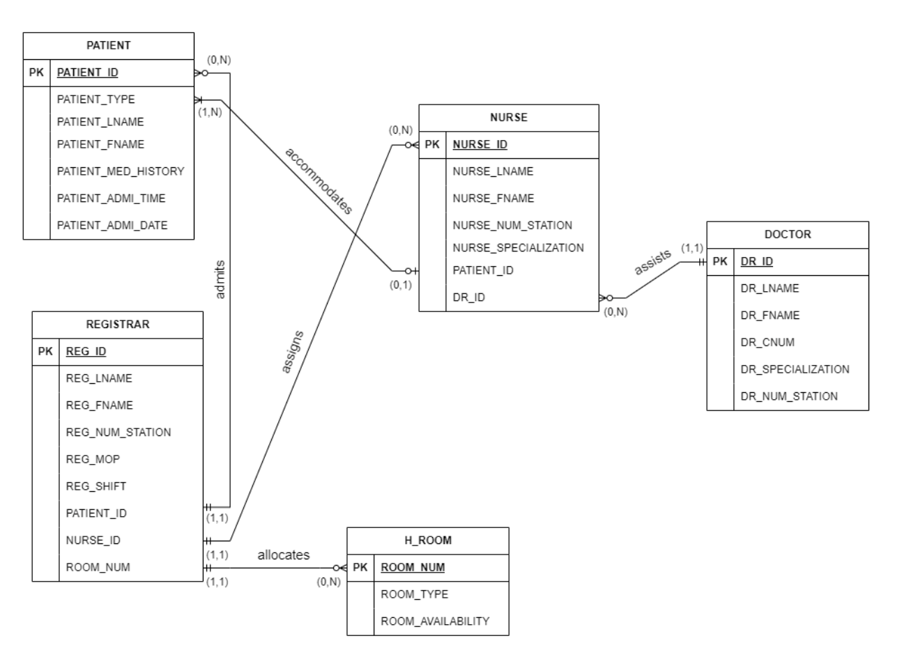
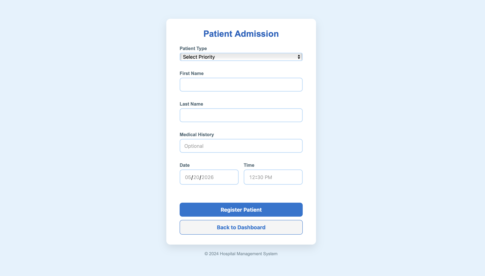
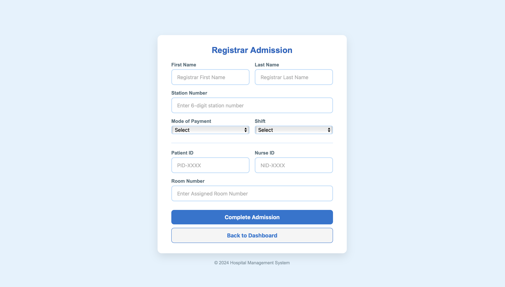
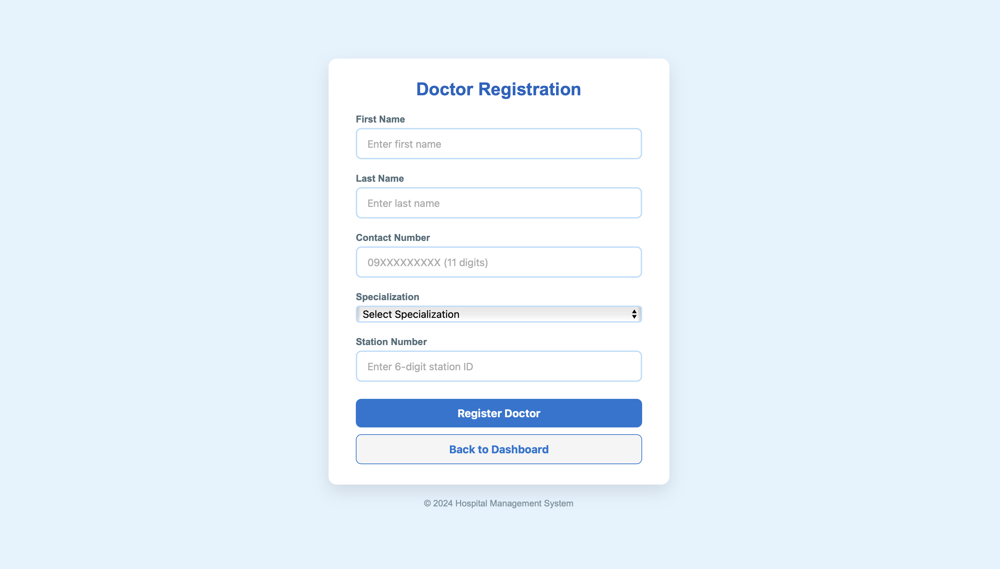
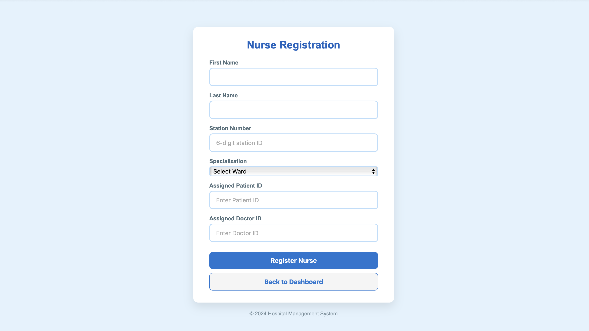
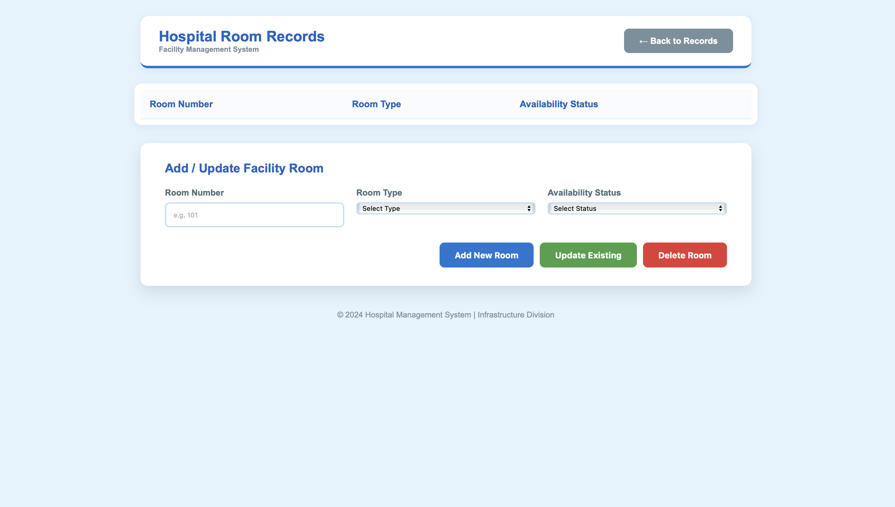
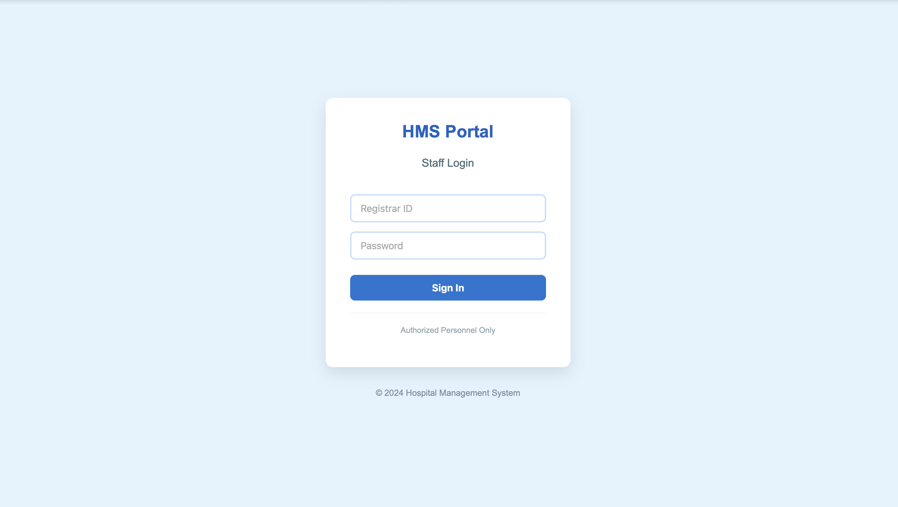
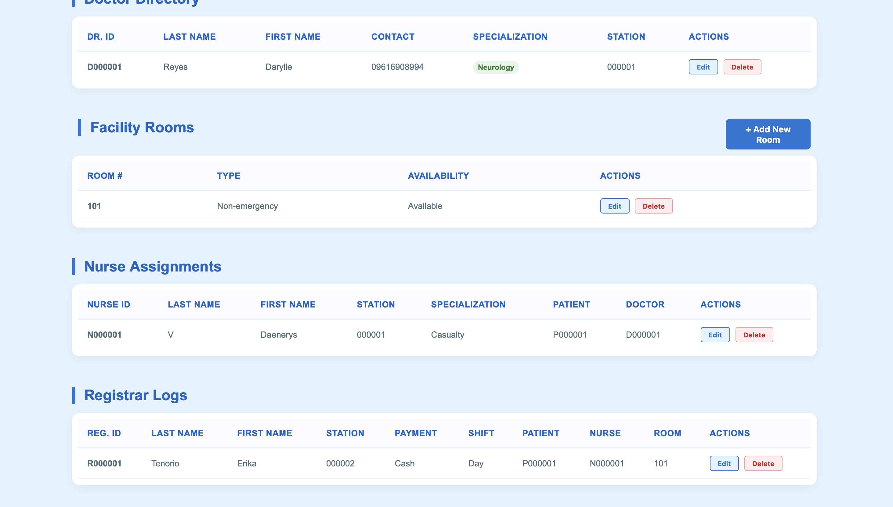
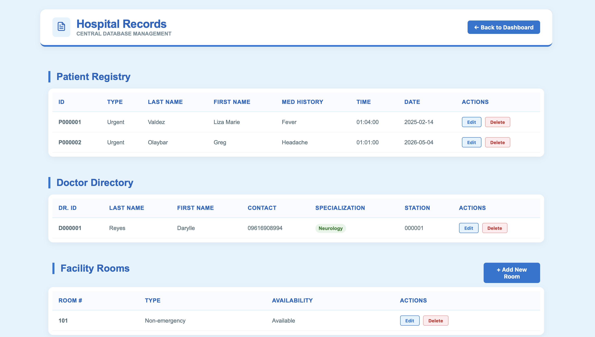

# Hospital-Admission-and-Records-Management-System

Welcome to the Hospital Admission System: a trusted partner in optimizing patient care and hospital administration. This system has been carefully designed to meet the gap between operational excellence and exceptional healthcare delivery, meeting the needs of administrators, clinicians, and patients alike. Here, our mission, though straightforward, makes all the difference by making it simpler and making processes within a hospital's admittance much easier and also very reliable, thus enabling patients to be well treated.

Whether it is record-keeping of patients, management of staff assignments, or even maximizing room utilization, this Hospital Admission System provides complete assistance. User-friendly interfaces and comprehensive functionality empower the administrator to manage admissions and registrar profiles, nursing staff, doctor schedules, and room availability within one platform.

We all know the issues that have been happening in a hospital setting: the problems of maintaining accuracy and efficiency. That is why our system will be able to give fast access to critical information, robust data management tools, and secure workflows that ensure the integrity of sensitive records. Adding new patients, updating staff profiles, or even room allocations will be easy for you in the Hospital Admission System because it will make every step easy for you to focus on what matters: delivering quality care.

Let the Hospital Admission System be your trusted guide toward better-organized, more efficient, and patient-friendly hospital management. Enjoy an operational future with better care facilitated by a system that supports your vision of excellence. Here starts your road to better health management!

## ER Diagram

## End-user Window Interfaces

The Hospital Admission System will support a wide variety of users, including patients, nurses, doctors, and registrars. The system should include a user-friendly interface for login and sign-up to ensure each type of user can access its appropriate features securely based on roles. Patients can create their profiles and update them. Patients can also manage the details of their admission and review their medical histories. Nurses and doctors can log in, update care routines, look at patient progress, and more. Registrars can enter to access most of the hospital data in updating patient files, staff profiles, rooms, and more.

The system consists of 4 major sections: Patients, Registrar, Nurse, and Doctor. Each tab was designed for working on some particular business. This will allow patients' data like contacts and admission notes to be added or edited. All shift schedules and the personal information management are there under the registrar profile. Under the Nurse and Doctor tabs, staff profiles can either be added or updated, or even removed to make sure there is proper assignment in the care team. 

The system validates data to ensure the proper inputting of data. In the process, deleting actions require user confirmation to prevent critical data loss inadvertently. The intuitive interface and clear workflow allow each user to focus on their role and responsibilities, which means efficient hospital management. Whether it is to view health information by a patient, update patient care information by a nurse, manage treatments by a doctor, or oversee a hospital running by a registrar, it all happens securely and efficiently as data is handled.

The Patients section provides the administrator with patient information management tools, such as personal information, date and time of admission, and medical history. Users can browse records, input new patients using a form that contains detailed input requirements, update existing records, or delete records as necessary. The Registrar section deals specifically with the hospital's administration staff, who handle admissions. The tab offers access to registrar records, including personal information, station number, mode of payment, shifts assigned, patient ID, nurse ID, and Room Number. Admins can add new registrars' records, update existing ones, or delete them when necessary.

Nurse section is focused on the administration and management of the nurse staff profiles and their assigned station number. A record list of nurses, along with specialty and assigned patients and doctors, appears on the screen and also adds new staff or edits profiles or deletes records respectively. In the same line, the Doctor section is doctors' profile administration, in which managers manage doctors' personal information, station number, and specialty, adding new doctors and updating existing profiles by deleting the record, as shown below.

Room management is located in the Room section, where administrators can view the room number and availability. This includes looking at the room type, whether it's emergency or non-emergency. It may also add rooms to the system or update existing information, and a list of unused rooms shall be deleted. Administrators can accurately search, filter, and manage complete admission records across the linked data.

## Back-end / Systems Administrator Window Interface
A hospital admission system's back-end/system administrator interface will provide the administrator with complete control over patient admissions, staff records, and room management given that they are knowledgeable of its password. The interface is split into five primary sections: Patients, Registrar, Nurse, Doctor, and Room. Each section provides essential tools for the efficient management of hospital operations. Functions such as Insert/Add, Update/Edit, and Delete can be accessed across all tabs to allow flexibility in handling records.

All the tabs have simple navigation features through instant search bars in record lookups, and there are validation checks that ensure proper formatting by forcing such formatting on the data either when inserting it or editing it. This interface has enabled the smooth management of hospitals since it protects the integrity and security of sensitive information.

